## STM32 学习笔记：调试资料

[toc]

## Segger Ozone
参考：
- https://www.segger.com/products/development-tools/ozone-j-link-debugger/

Ozone 是 Segger 公司开发的一个调试工具，用于 Trace 程序的运行。

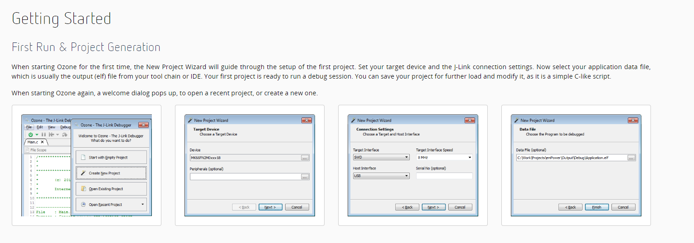

调试初始化配置方法：
1. 打开软件，创建一个新的工程：
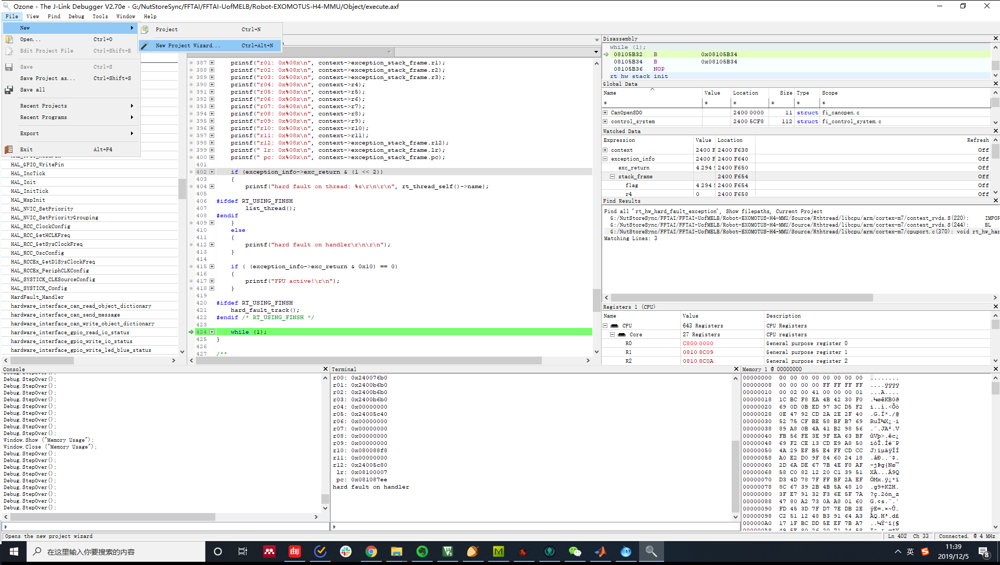

2. 选择目标器件：
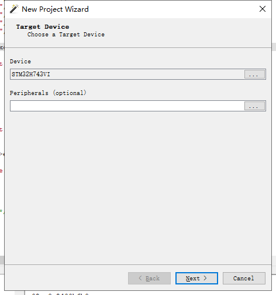

3. 选择通信方式：
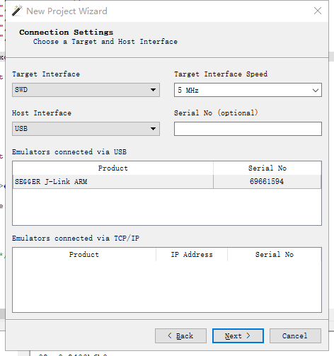

4. 选择链接文件：


5. 给需要调试的位置打上断点：（可以通过 Find in File 查找到你要找的函数）
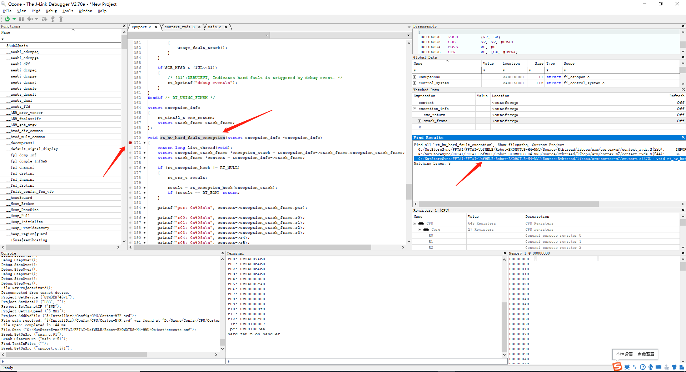

6. 打开 Terminal 窗口：
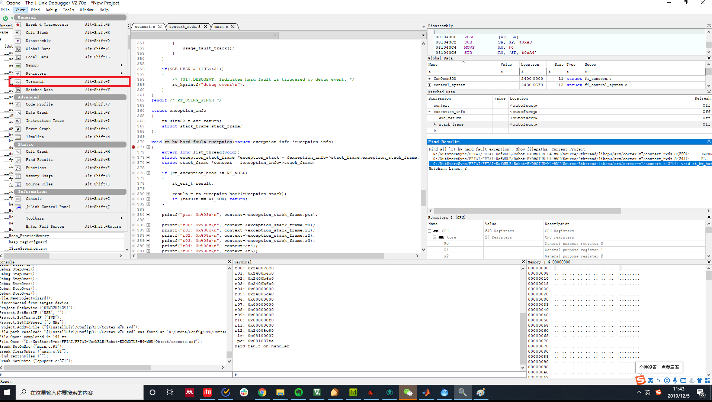

7. 配置 Trace：

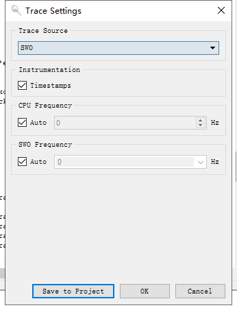

8. 下载并运行程序：
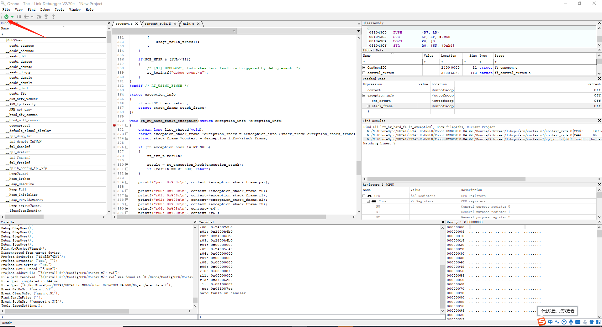

9. 这样，通过 `printf()` 函数，在 Terminal 窗口下你就能看到自己需要打印的信息了。
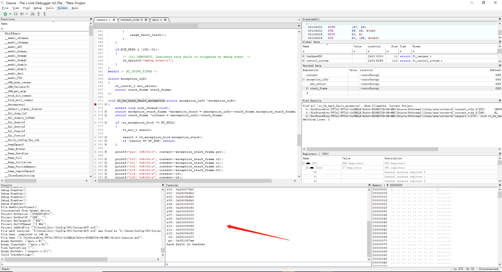


## 问题记录与解决方法
### Keil 使用 库，C 语言使用库的方法
参考：
- http://mcu.eetrend.com/forum/2016/100002534.html

---

1. 关于制止LIB库文件的几点经验
	1. 一个工程如何生成lib文件：
		- 一个生成lib文件的工程可以调用这个工程中不存在的函数，只需要在.h文件中声明这些不存在函数的原型，然后在调用这个lib文件的工程中实现这些函数即可。
		- 由上面一点可得出一个生成lib文件的工程改成生成hex文件或者bin文件那么可能编译错误（找不到未声明函数的原型），但是如果是生成lib的可以编译成功。

2. 制作LIB的一般步骤（只有一个C文件，不存在调用LIB工程外的函数）：
	1. 将此C文件添加至一个测试工程，生成HEX文件或者BIN文件
	2. 将此文件内所有函数的功能全部测试通过
	3. 新建一个工程，只添加此C文件和一些必要的H文件（例如使用的芯片的库文件），再添加一个H文件，此H文件里面将调用此LIB的所有函数、宏、变量做 **extern** 声明
	4. build工程即可，切记输出选择Create Library。

3. 如果一个LIB工程里面有多个C文件，且需要调用LIB工程外部的函数时，建议步骤如下：
    1. 将全部C文件添加至测试工程，生成HEX文件或者BIN文件
    2. 将所有函数的功能全部测试通过
    3. 新建一个工程，添加需要的 C 文件，
	    - 在第一个H文件内声明LIB工程内使用的函数，
	    - 第二个H文件内声明原型在工程内部，供工程外部调用的函数，
	    - 在第三个H文件内声明原型在工程外部，供工程内调用的函数
	4. build工程，生成lib文
	5. 在调用LIB文件的工程中include第二个和第三个H文件，
		- 实现第三个H文件内的所有函数，
		- 调用第二个H文件内的函数，
		- 第一个文件在LIB工程内使用即可，调用LIB文件的工程无需include。

> 附注：
> - 从这里可以看出，库文件 .lib 更像是 .c 文件编译后 .o 文件的合集。
>     - 
>     - 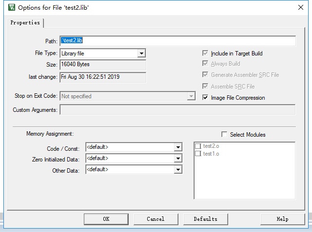
> - 同时，尽量避免多个 .lib 添加了同样的 .c 源文件，否则，会导致项目越来越庞大。在构建 .lib 文件时，只需要相应的 .h 文件，就可以无 warning 编译通过，这样就避免了引用同样的 .c 源文件。

### Keil 支持 C++
参考：
- https://www.amobbs.com/thread-3959239-1-1.html
- http://www.keil.com/support/docs/3696.htm


### Keil C++ 和 C 互相调用
参考：
- https://stackoverflow.com/questions/16850992/call-a-c-function-from-c-code
- https://stackoverflow.com/questions/2744181/how-to-call-c-function-from-c

### Keil 报错 "declaration may not appear after executable statement in block"
问题描述：
- 将 DSP 的电机控制代码拖入 STM32 的工程文件，编译后，报错

参考：
- https://blog.csdn.net/fushiqianxun/article/details/7939123
- https://www.cnblogs.com/DawaTech/p/7698896.html

问题来源：
- 没有使用 C99 Mode，在以前的老版本编译器，会要求变量的定义必须位于函数的开头，而 C99 Mode 没有作此要求。

解决办法：
- 方法一：将所有变量定义放置于函数开头
- 方法二：启用 C99 编译器

### 使用新的 STM32 硬件平台，使用原来的代码，初始化程序运行不通过
问题描述：
- 由于购买的开发板是 STM32F407xx 系列的，所以所有的例程代码都是基于该平台的。但是公司这边新的开发板是 STM32F405xx 平台的，在使用原先的代码时，发现提供的例程代码无法正常初始化系统的硬件，往往会出现程序在初始化的过程中卡死。
	- 比如说时钟的初始化，虽然都是使用外部时钟，但是由于开发板使用的是 8Mhz 的外部晶振，而公司设计的控制板是 25Mhz 的晶振，因而时钟的初始化程序需要重新配置。
	- 使用 STM32Cube 配置 STM32F407xx 时可以配置时钟源为外部时钟 HSE，但是在配置 STM32F405xx 时无法选中外部时钟，这里不清楚是什么原因。
	- STM32F407xx 的基于 HAL 库的函数用的是老版本的 HAL 库函数，但是 STM32Cube 现在提供的是新版的 HAL 库，所以会出现程序编译出错，需要的函数方法已经被废弃的情况。

解决办法：
- 优先使用 STM32Cube 进行系统的初始化配置，因为这是官方提供的自动初始化程序生成工具，具有权威性和实效性。利用这个生成的程序，基本都是能够正常编译通过并使用的。
- 然后基于生成的程序，再继续扩展，移植自己定义得程序代码。

### CAN 模块 FIFO 接收数据问题
问题描述：
- 如何配置 CAN 模块使用 FIFO 模式，且用 FIFO0 进行数据的接收？

参考：
- https://blog.csdn.net/varding/article/details/39179125

### CAN 模块可以发送数据，不能接受数据问题
问题描述：
- 以 HCU 模块为例，该模块可以发送 CAN 消息，但是接收 CAN 消息失败。

解决办法：
- 需要注意到 STM32F1XX 系列和 STM32F4XX 系列在 CAN Filter Bank 的数量上式不一样的。在 STM32F1XX 中只有 CAN1，没有 CAN2，因此，它的 Acceptance Filters 只能为 0 - 13（共 14 个）。而 STM32F4XX 可以为 0 - 27 （共28个）。
	- 这里如果设置错误，在 HAL 库中是不会报错的，但是实际上内存会写错，而且 CAN 模块的接收功能无法启动。

示例代码：
```
/*********************************
 *
 *	Function : 
 *
 *********************************/
void Hardware_HCU_V1_CanModel_setAcceptID(
	struct Hardware_HCU_V1_CanModel * hardware_HCU_V1_CanModel, 
		unsigned int acceptID)
{
	#if defined(USE_HAL_STM32F1XX)
	
	hardware_HCU_V1_CanModel->acceptID = acceptID;
	
	CAN_FilterTypeDef  CAN1_FilerConf;
	
//	CAN1_FilerConf.FilterIdHigh 		= 0X0000; //32λID
//  CAN1_FilerConf.FilterIdLow 			= 0X0000;
//  CAN1_FilerConf.FilterMaskIdHigh 	= 0X0000; //32λMASK
//  CAN1_FilerConf.FilterMaskIdLow 		= 0X0000;  
	CAN1_FilerConf.FilterIdHigh 		= (((uint32_t)acceptID << 21) & 0xFFFF0000) >> 16;
	CAN1_FilerConf.FilterIdLow 			= (((uint32_t)acceptID << 21) & 0x0000FFFF);
	CAN1_FilerConf.FilterMaskIdHigh		= 0xFFFF; //32λMASK (all meet)
	CAN1_FilerConf.FilterMaskIdLow 		= 0xFFFF; 
	CAN1_FilerConf.FilterFIFOAssignment = CAN_FILTER_FIFO0;
	CAN1_FilerConf.FilterMode 			= CAN_FILTERMODE_IDMASK;
	CAN1_FilerConf.FilterScale 			= CAN_FILTERSCALE_32BIT;
	CAN1_FilerConf.FilterActivation 	= ENABLE;
	CAN1_FilerConf.FilterBank 			= 0; // write 14 here will make can module not work !!!
	
	if(HAL_CAN_ConfigFilter(&hcan1, &CAN1_FilerConf)!=HAL_OK) while(1);	//Â˲¨Æ÷³õʼ»¯

	#endif
}
```

### 调用函数对变量进行赋值，程序跳过赋值过程，直接给0
问题描述：
- 源代码如下：
```
// Control Word bit 5 is "change set immediately." 
// Clearing it tells the amplifier to treat a series of moves as a series of discrete profiles.
controlWord = CANInterface_getControlWord(&canInterface);
controlWord = controlWord & 0xFFEF;
CANInterface_setControlWord(&canInterface, controlWord);
```
- 函数运行完成后，并没有给 controlWord 进行赋值操作。

参考：
- https://blog.csdn.net/cinmyheart/article/details/17271009

问题解决：
- 该段代码经汇编编译后，变成（开编译优化）：


- 该段代码经汇编编译后，变成（不开编译优化）：


- 可以看出，开编译优化后，在调用函数后，没有对变量的赋值操作。而在无编译优化时，存在对变量的赋值操作汇编代码。因此，如果是进行芯片的调试，优先关闭代码优化。

### 在 C 语言中实现类似面向对象中的类
参考：
- https://www.cnblogs.com/swust-wangyf/p/6817055.html

在C语言结构体中添加成员函数：
```
#include<stdio.h>
#include<stdlib.h>
typedef struct node
{
    int a;
    void(*p)(int b);
}no;

void fun(int b)
{
    printf("hello,%d\n",b);
}

int main()
{
    no a = { 1,fun };

    a.p(a.a);
    system("pause");
    return 0;
}
```

### 不同平台的代码迁移
问题描述：
- 针对使用 HAL 库的平台，如何实现工程代码在不同平台上的迁移？

参考：
- STM32CubeMX 软件生成的代码

解决办法：
1. 修改 `Drivers/MDK-ARM` 下的 .s 硬件配置文件。
	- 例如：**startup_stm32f405xx.s** ---> **startup_stm32f407xx.s**
2. 修改 `Drivers/CMSIS` 下的 .c 启动程序文件。
	- 例如：**system_stm32f4xx.c** ---> **system_stm32f7xx.c**
3. 修改 **Option for Target ...** 选项下的 **C/C++** 选项下的 **Preprocessor Symbols** 中的 **Define**。
	- 例如：**USE_HAL_DRIVER.STM32F405xx** ---> **USE_HAL_DRIVER.STM32F407xx**

### 两台计算机互相 ping，一台可以 ping 通另一台，另一台 ping 不通这一台
问题描述：
- 两台计算机互相 ping，A可以 ping 通B，B ping 不通A

参考：
- 

解决办法：
- 被 ping 的那台，ping 不通的话，可能是开了防火墙，防火墙会不允许接收 ping 操作

### 用 C++ 开发 STM32 可能会遇到的问题
参考：
- https://blog.csdn.net/qq_39276007/article/details/79245299

总结：
1. 在KEIL5.18a以前的版本（包括5.18a）所支持的Arm Compiler只有ARM Compiler 5以及更低的版本，C++11支持不完整，而对C++11有完整支持就必须要使用Arm Compiler 6 即 AC6。为了使用对C++11有完整支持的Arm Compiler 6(AC6)，今天所使用的KEIL MDK版本至少应用为5.20版本以上（Arm Compiler 6.4）。
2. 真正的C++开发是**不能链接 microlib**的，因为他只是标准C library的一个精简集。网上能查到microlib的一些限制，这里列举一些出来：
	- Microlib和标准的IOS C库不兼容，所以不支持有些ISO所提供的特性或者功能不完整
	- 仅对C99库提供有限的函数支持
	- Microlib不支持C++
	- 不支持位置独立的代码
	- 不支持单个或双个的内存区域模型
	- 不支持Mutex以及不支持宽字符
	- 
3. AC6己经不支持直接声明 **__weak了，需要使用 __attribute__((weak))**替代。

### C 语言 结构体作为参数传递到函数
参考：
- https://www.cnblogs.com/shuqingstudy/p/7226257.html?utm_source=itdadao&utm_medium=referral
总结：
- 结构体对象作为参数时，编译器对其进行了copy,（我们通过传入的地址和main中不同可以发现）。此时在函数中的操作都是对其拷贝的操作，不影响main函数中的origin value。缺点是，当结构体变量非常大时，编译器对其进行复制，开销较大。
- 结构体地址作为参数时，子函数中操作和main函数操作的是同一个结构体，此时传递的参数时一个地址。优点是不需要进行copy，但是使用时要小心，如果不想修改其值，需用const关键字修饰

### HardFault_Handler的处理方法
参考：
- https://blog.csdn.net/android_lover2014/article/details/80007244

### 字节序 大小端问题
1. 大端字节序场景：
	- Java 语言中（Java 虚拟机中）
	- 网络数据传输

2. 小端字节序：
	- STM32 平台
	- WIndows C# 平台


### Stm32 debug停留在"BKPT 0xAB"或者"SWI 0xAB"的解决办法
参考：
- http://www.eeworld.com.cn/mcu/article_2016122632650.html
- https://blog.csdn.net/u012819339/article/details/49893237

方法：
1. 添加 Microlib
2. 删除程序中的 "printf()" 和 "scanf()" 代码
	- 微库“Microlib”不具备ISO C的某些特性，某些库函数运行的也比较慢，具体不同之处参照参考链接。当然它的好处在于，其代码经过高度优化而变得很小，可以使用malloc，其内置了一个堆管理模块。具体不同会在第三部分参考链接中贴出。

### 局部变量初始化出错，内存对应到 0x00000000
问题描述：
- 在使用局部变量时，有时候会出现即使初始化了局部变量，在初始化完后，局部变量的值仍然为一个很奇怪（很小）的数，不是设定的值。通过将局部变量的地址打印出来，地址对应到了 0x00000000。

问题来源：
- 编译器会对局部变量自动做优化，通过汇编代码可以看出，在取一部分局部变量时，会通过寄存器来取值，而不是直接从内存中去取值。从而如果寄存器保存的数据有问题，从而

解决办法：
- 给局部变量添加 `volatile` 关键字，避免编译器进行优化处理。

### Malloc_new 赋值给指针变量失败
1. 问题描述：
    - 使用 `Malloc_new()` 给指针赋值，出现赋值失败，总是为 0 的问题。这个问题主要源于在 `Malloc_new()` 方法返回时，r4-r6 的寄存器会恢复原值，而传入参数的值也在这些寄存器中，所以导致数据传不出来，被覆盖掉。
```
u8 ETH_Mem_Malloc(void)
{ 
#if defined(USE_STM32_F407XX)

	volatile void * _DMARxDscrTab;
	volatile void * _DMATxDscrTab;
	volatile void * _Rx_Buff;
	volatile void * _Tx_Buff;
	
	Malloc_new(_DMARxDscrTab, ETH_RXBUFNB*sizeof(ETH_DMADescTypeDef));//ÉêÇëÄÚ´æ
	Malloc_new(_DMATxDscrTab, ETH_TXBUFNB*sizeof(ETH_DMADescTypeDef));//ÉêÇëÄÚ´æ  
	Malloc_new(_Rx_Buff, ETH_RX_BUF_SIZE*ETH_RXBUFNB);	//ÉêÇëÄÚ´æ
	Malloc_new(_Tx_Buff, ETH_TX_BUF_SIZE*ETH_TXBUFNB);	//ÉêÇëÄÚ´æ
	
	DMARxDscrTab = _DMARxDscrTab;
	DMATxDscrTab = _DMATxDscrTab;
	Rx_Buff = _Rx_Buff;
	Tx_Buff = _Tx_Buff;
	
	if(!(u32)&DMARxDscrTab||!(u32)&DMATxDscrTab||!(u32)&Rx_Buff||!(u32)&Tx_Buff)
	{
		ETH_Mem_Free();
		return 1;	//ÉêÇëʧ°Ü
	}	
	
#endif
	
	return 0;		//ÉêÇë³É¹¦
}

/******************************************************************************
 *
 *	Function : Malloc New
 *
 * 	Description : 
 *
 ******************************************************************************/
int Malloc_new(volatile void * mem, unsigned int size)  
{  
	void * _mem = 0;
	
	_mem = malloc(size);
	
	mem = _mem;
	
	return RESULT_OF_UTILS_MALLOC_FUNC_SUCCESS;
}
```

2. 解决办法：
	 1. 使用返回值，而不是指针参数作为数据的传递方式。
	 2. 对指针进行初始化操作，使指向特定的内存。

### STM32 使用 malloc 方法导致程序死机
1. 参考：
	- http://www.keil.com/support/man/docs/armlib/armlib_chr1358938939461.htm

2. 解决办法：
	- 使用 malloc 等标准 C 函数，最好不要使用 microLib。
	- 使用标准 C 和 microLib 编译，在不开编译优化时，产生的代码是一样大小的。

### STM32 定时器中断挂掉
1. 问题描述：
	- 在调试 STM32F4 的机器的时候，发现中断定时器挂掉，从而系统时钟停止计时，导致程序死在 CAN 发送消息的循环中。

2. 问题来源：
	- STM32F4 的 CAN 总线如果出现数据的堆积就会造成该现象。如果外部 CAN 网络不通畅，导致 STM32 数据发送不出去，从而造成数据堆积，最后导致中断挂掉。

3. 解决办法：
	- 修复外部 CAN 网络的连接，确认每个节点都是 OK 的。

### STM32 使用 C++11
参考：
- https://bbs.robomaster.com/thread-5414-1-1.html

### KEIL 自动排版
参考：
- http://astyle.sourceforge.net/


### KEIL 使用 ARM Compiler 6 无法调用一些 C++ 常规库，如 vector
说明：
- 当我们将工程从 ARM Compiler 5 修改为 ARM Compiler 6 后，编译器的搜索路径发生了变化。
- ARM Compiler 5 的搜索路径为 `KEIL/ARM/ARMCC/include`
- ARM Compiler 6 的搜索路径为 `KEIL/ARM/ARMCLANG/include`
- 所以，我们需要在对应的 `KEIL/ARM/ARMCLANG/include` 下面去寻找我们需要的头文件。
	- 以我们使用的 vector 头文件为例，该文件就位于 `KEIL/ARM/ARMCLANG/include/libcxx`，所以我们应该使用 `#include <libcxx/vector>` 进行对应头文件的引用。

### RTThread rt_timer_check() 函数死掉
问题描述：
- RTThread 在启动后，尚未进入主程序就死掉了，死在了 `rt_timer_check()` 方法中，因为 timer 不存在，但是去读取了它的信息（访问地址非法）。

问题原因：
- 这个是因为在 `int rtthread_startup(void)` 函数的开始，没有添加 `rt_hw_interrupt_disable();` 方法，关闭中断（定时器），所以在 SysTick 中断里面会去查询，从而导致出错。

解决办法：
- 在 `int rtthread_startup(void)` 开头添加 `rt_hw_interrupt_disable();`


### STM32 使用 JLink 进行 printf 输出，打印 log 信息
参考：
- http://www.keil.com/support/man/docs/jlink/jlink_trace_itm_viewer.htm
- https://blog.csdn.net/bubuxindong/article/details/79317096
- http://www.stmcu.org.cn/module/forum/thread-606866-1-1.html

操作流程：
1. 创建 .c 和 .h 文件，内容如下：
```c
#ifndef _FI_DEBUG_H_
#define _FI_DEBUG_H_

#define ITM_Port8(n)    (*((volatile unsigned char*)(0xE0000000+4*n)))
#define ITM_Port16(n)   (*((volatile unsigned short*)(0xE0000000+4*n)))
#define ITM_Port32(n)   (*((volatile unsigned long*)(0xE0000000+4*n)))
#define DEMCR           (*((volatile unsigned long*)(0xE000EDFC)))
#define TRCENA          0x01000000

#endif
```

```c
#include <stdio.h>
#include "fi_debug.h"

// struct __FILE { int handle; /* Add whatever you need here */ };
FILE __stdout;
FILE __stdin;

int fputc(int ch, FILE *f) {
  if (DEMCR & TRCENA) {
    while (ITM_Port32(0) == 0);
    ITM_Port8(0) = ch;
  }
  return(ch);
}
```

2. 配置 JLink
	- 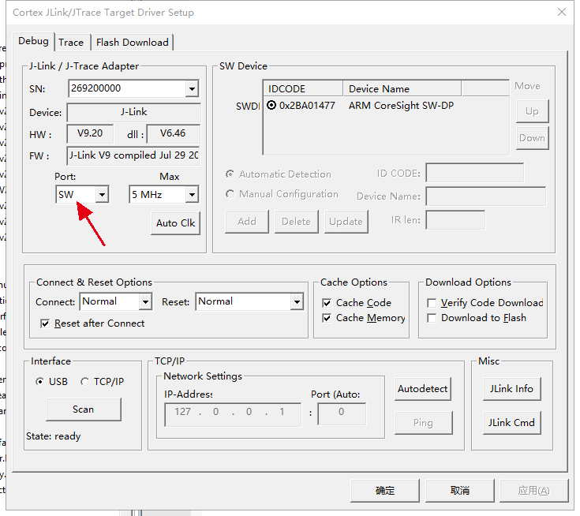
	- 

3. 使用打印函数
	- 引入头文件 `#include <stdio.h>`
	- 使用打印函数 `prinf("xxx")`

### C 封装自己的 printf
参考：
- https://www.cnblogs.com/adong7639/p/4186779.html
- http://www.cplusplus.com/reference/cstdio/vprintf/

代码：
```
#include <stdio.h>  
#include <stdarg.h>  

//方式一
#define DBG_PRINT (printf("%s:%u %s:%s:\t", __FILE__, __LINE__, __DATE__, __TIME__), printf) 

//方式二
void MyPrintf(const char *cmd, ...)  
{  
    printf("%s %s ", __DATE__, __TIME__);  
    va_list args;       //定义一个va_list类型的变量，用来储存单个参数  
    va_start(args,cmd); //使args指向可变参数的第一个参数  
    vprintf(cmd,args);  //必须用vprintf等带V的  
    va_end(args);       //结束可变参数的获取
    printf("\n");  
}  

int main()
{
    MyPrintf("%s", "hello world");
    MyPrintf("hello world");
    MyPrintf("%d %f", 15, 16.3);

    DBG_PRINT("%s", "hello world");
    DBG_PRINT("hello world");
    DBG_PRINT ("%d %f", 15, 16.3);
    return 0;
}
```

### Malloc 申请二维数组
参考：
- https://blog.csdn.net/weixin_43480094/article/details/83932634

